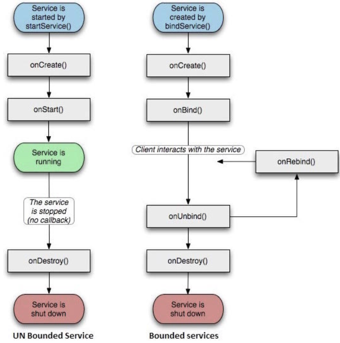

# Service
无交互，长运行在后台的程序，多用于给前台提供一些不直接交互的功能；
- startService(),进入started状态，持续运行即使启动它的组件已销毁；
- bindService(), bound状态，提供客户服务器接口来允许组件与服务交互，IPC通信等；


[Google官方文档](https://developer.android.com/develop/background-work/services?hl=zh-cn)

[CSDN](https://blog.csdn.net/javazejian/article/details/52709857)

## 自定义服务
1. manifest注册；
2. 继承Service类实现自己的服务；
3. activity中启动或绑定服务；

## 前台服务
可以由用户感知，能够交由用户控制的服务；
1. 服务执行过程中，`startForegroud(int id, Notification noti)`把当前服务设置为前台服务，
来发出一个持续的通知；
2. `stopForegroud(boolean removeNotification)`停止前台服务；

## 两种启动
重要的回调函数：
- onBind()
- onCreate()
- onStartCommand(Intent intent, int flags, int startId)
- onDestroy()

### startService()
- 会执行onCreate、onStartCommand、onDestroy回调；

### bindService()
绑定服务，获取服务中的接口，绑定的对象死亡则服务也会被销毁；`onBind`方法返回一个ibinder，实现IBinder接口，来使得客户端调用服务端；或使用handler-message; 或使用AIDL。

#### 实现Binder通信
1. service中实现接口类IBinder并定义方法，在该方法中返回service的实例，返回给客户端，供其使用service方法；
```
public class LocalService extends Service{
    private LocalBinder binder = new LocalBinder();
    public class LocalBinder extends Binder {
        LocalService getService() {
            return LocalService.this;
        }
    }

    @Nullable
    @Override
    public IBinder onBind(Intent intent) {
        return binder;
    }
    ...
}
```
2. 客户端创建一个ServiceConnection类的实例，传入bindService和unBindService,实例里实现两个方法`onServiceConnencted(Component name, Ibinder binder)`和`onServiceDisconnected`,在其中接收binder实例并获取service实例；
```
private ServiceConnection conn = new ServiceConnection(){
    @Override
    public void onServiceConnected(ComponentName name, IBinder service) {
        LocalService.LocalBinder binder = (LocalService.LocalBinder) service;
        mService = binder.getService();
    }

    @Override
    public void onServiceDisconnected(ComponentName name) {
        mService=null;
    }
};

bindService(intent, conn, Service.BIND_AUTO_CREATE);

unbindService(conn);
```

#### 使用messager通信
