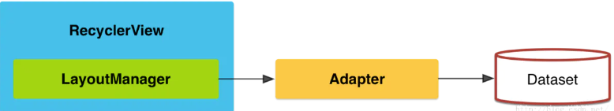

# UI

## 问题记录

### button无法修改颜色，总是紫色
在res/values/themes.xml和res/values-night/themes.xml中，原代码为：
```
<style name="Theme.MyApplication" parent="Theme.MaterialComponents.DayNight.DarkActionBar">
```
添加：
```
<style name="Theme.MyApplication" parent="Theme.MaterialComponents.DayNight.DarkActionBar.Bridge">
```

###

## 基本控件
### Button设置背景颜色、按下颜色等
在res/drawable目录下新建xml文件：
```
<?xml version="1.0" encoding="utf-8"?>
<selector xmlns:android="http://schemas.android.com/apk/res/android">

        <item android:state_pressed="true"><shape>
            <solid android:color="@android:color/holo_red_light" />
            <stroke android:width="1dp" android:color="@color/material_dynamic_neutral80" />
            <corners android:radius="100dp"/>
        </shape></item>


        <item android:state_enabled="false"><shape>
            <solid android:color="@color/material_dynamic_neutral80" />
            <stroke android:width="1dp" android:color="@color/material_dynamic_neutral80" />
            <corners android:radius="100dp"/>
        </shape></item>

    <item><shape>
        <solid android:color="@android:color/white" />
        <stroke android:width="1dp" android:color="@color/material_dynamic_neutral80" />
        <corners android:radius="100dp"/>
    </shape></item>


</selector>
```
在其中设置一个selector，

### SurfaceView
surfaceView继承自View，可以通过代码改变大小：
```
Holder holder = getSurfaceHolder();
holder.setSizeFromLayout();
holder.setFixedSize(...);
```
### EditText
[EditText文档](https://www.runoob.com/w3cnote/android-tutorial-edittext.html)

### AlertDialog
1. 在要触发时build一个AlertDialog，按照需要的选择方式构建，（Builder模式）
```
AlertDialog.Builder = new AlertDialog.Builder(context);
AlertDialog alertDialog = Builder.setIcon(...)
                                 .setTitle(...)
                                 .setSingleChoiceItems(String, int, DialogInterface.OnclickListener)
// 设置其他模式：
.setMultiChoiceItems(String[], boolean[], Listener);
.setItems(String[], listener);
.setPositiveButton(String, listener);
```
自定义alert（颜色、按键、文字提示等）
```
View view_custom = getLayoutInflator().inflate(R.layout.dialog_custom_view,
                                               null, false);
builder.setView(view_custom);
```
[AlertDialog](https://www.runoob.com/w3cnote/android-tutorial-alertdialog.html)

### ProcessDialog
[ProcessDialog](https://www.runoob.com/w3cnote/android-tutorial-dialog.html)

### RadioButton&CheckBox
[radioButton&CheckBox](https://www.runoob.com/w3cnote/android-tutorial-radiobutton-checkbox.html)

#### RadioButton单选按钮
将几个radioButton安置在RadioGroup中，再设置一个选择完成Button；
`setOnCheckedChangeListener(new OnCheckChangeListener(){...});`；可以获取选中的内容；里面`radioButton.getText();`

或获取radioGroup，通过`group.getChild(int)`获取对应rb，通过`rb.isChecked()`来确认是否被点击，并获取内容；

`group.getChildCount()`获取rb个数；

#### CheckBox
只是RadioButton的多选版本，操作一样；

### Menu
[Menu](https://www.runoob.com/w3cnote/android-tutorial-menu.html)

#### OptionMenu
重写：
```
public boolean onCreateOptionsMenu(Menu menu){}  // 初始化菜单，设置内容
public boolean onOptionsItemSelected(MenuItem item){}

public void onOptionsMenuClosed(Menu menu){}
public boolean onPrepareOptionsMenu(Menu menu){}
public boolean onMenuOpened(int featureId, Menu menu){}
```

#### ContextMenu
长按调出菜单；
1. 重写`onCreateContextMenu(){}`初始化；
2. 为要长按的view组件注册contextMenu, 使用`registerForContextMenu(View view)`方法；
3. 重写`onContextItemSelected(){}`;

#### SubMenu
子菜单，在菜单的item中嵌套一个menu；

## 子布局 layout
### RelativeLayout
相对布局，以互相为参照

### LinearLayout
线性布局，横向或纵向排列

### FrameLayout
设置一个背景，再设置一个前景，让前景覆盖背景形成的效果；

### PercentFrameLayout
位置百分比设置布局

### ConstrainedLayout
设置限制布局

## 列表式，多数据显示
### ListView
[ListView文章](https://www.cnblogs.com/lyw-hunnu/p/12687201.html)

1. 首先设置一个ListView；
2. 为ListView中的item设置一个单独的布局xml文件（layout file），其中设定了每个item内的具体布局；
2. 为ListView传入一个Adaptor，可以在Adaptor内设置列表项布局（），点击响应等；
3. Adaptor负责传递数据给ListView的item；
       3.1ArrayAdaptor：可以直接传入一个List，构造adaptor时会将其转化成Array类型；
       3.2 SimpleAdaptor：可以设置更丰富的页面布局，可扩展性好；
```
adapter = new SimpleAdapter(Context context,   // 上下文
                            List<Map<String, Object>>,  // list内每个map对应每个item里要显示的内容，map里存放了多个键值对，键值为名称，对应下面的from参数，值为该控件要显示的东西；
                            R.layout.list_view_layout,  // item的布局
                            String[] from,   // 数据对应的键值，与to一一对应
                            new int[]  // 对应的控件名);
```
       3.3 BaseAdaptor: Adaptor的基础类，可以重写方法自己实现；
4. Adaptor可以通过`setViewBinder`来设定自己的显示逻辑，如如何将data送给view去显示，这样在传给adaptor数据lsit的时候可以更灵活。
```
adapter.setViewBinder(new SimpleAdapter.ViewBinder() {
    @Override
    public boolean setViewValue(View view, Object data, String textRepresentation) {
        ...
        return false;
    }
});
```

### GridView
与ListView类似



### RecyclerView
1. 添加布局；
2. 设定layout file来决定item样式；
3. 重写RecyclerView.Adapter中的方法来设置adapter；
       3.1 ViewHolder类
       ViewHolder类用来处理和拿到单个item的布局中的每个view，保存在其成员变量中供使用；是Adapter的内部实现类，在创建Adapter用到的的模板类传入它；
       3.2 onCreateViewHolder(...);
       用于创建一个Viewholder实例，存储在Adapter的成员变量中；
       3.3 onBindViewHolder();
       在这里逐个将数据写入当前item的每个view中，使用viewHolder来操作每个view的数据写入；
       3.4 getItenCount(int position);
       得到item的数量
```
public class RecyclerAdapter extends RecyclerView.Adapter<RecyclerAdapter.MyViewHolder> {
    List<String> pathList;
    Context context;

    public RecyclerAdapter(Context context, List<String> pathList){
        this.pathList = pathList;
        this.context = context;
    }
    @NonNull
    @Override
    public RecyclerAdapter.MyViewHolder onCreateViewHolder(ViewGroup parent, int viewType){
        View itemView = LayoutInflater.from(context).inflate(R.layout.single_item_layout, parent, false);
        return new MyViewHolder(itemView);
    }

    @Override
    public void onBindViewHolder(MyViewHolder holder, int position){
        String path = pathList.get(position);
        Bitmap bitmap = BitmapFactory.decodeFile(path);
        holder.imageView.setImageBitmap(bitmap);
    }

    @Override
    public int getItemCount(){
        return pathList.size();
    }

    public class MyViewHolder extends RecyclerView.ViewHolder{
        ImageView imageView;
        public MyViewHolder(View itemView){
            super(itemView);
            imageView = itemView.findViewById(R.id.list_item);
        }
    }
}
```     

4. 设置LayoutManager

LayoutManager用来管理item内的布局；提供操作item的过程动画；

        4.1 与ListView效果对应的可以通过LinearLayoutManager来设置
        4.2 与GridView效果对应的可以通过GridLayoutManager来设置
        4.3 与瀑布流对应的可以通过StaggeredGridLayoutManager来设置
        4.4 或自己实现LayoutManager，重写LayoutManager方法；

#### 与ListView优势
这个自定义Adapter和我们在使用Listview时候的Adapter相比还是有点不太一样的，首先这边我们需要继承RecyclerView.Adaper类，然后实现两个重要的方法onBindViewHodler()以及onCreateViewHolder(),这边我们看出来区别，使用RecyclerView控件我们就可以把Item View视图创建和数据绑定这两步进行分来进行管理，用法就更加方便而且灵活了,并且我们可以定制打造千变万化的布局。同时这边我们还需要创建一个ViewHolder类，该类必须继承自RecyclerView.ViewHolder类，现在Google也要求我们必须要实现ViewHolder来承载Item的视图。

### ViewPager
[ViewPager文章](https://juejin.cn/post/6844903544093409293)

可以直接用ViewPager2，由RecyclerView实现，因此使用方法与其相同，传入一样的Adapter。个人理解其实就和RecyclerView换了一种特别的LayoutManager差不多。

## 自定义view
